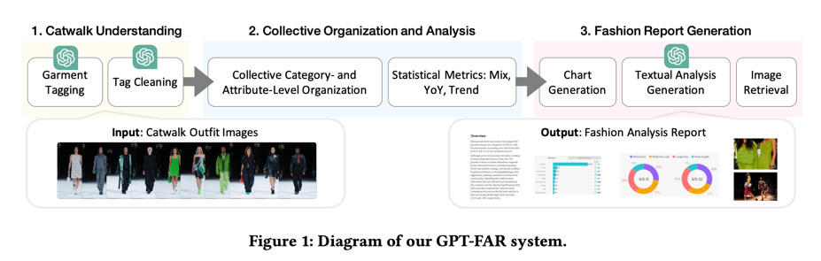

# FashionReGen
## Overview
This repository contains the code for the [FashionReGen paper](https://arxiv.org/abs/2403.06660), which proposes an LLM-empowered approach to fashion report generation. It provides a framework for **Catwalk Understanding**, **Collective Organization and Analysis**, and **Fashion Report Generation**, as illustrated in the figure below.



## Getting Started
### Key Steps for Report Generation
1. Prepare **catwalk images**. You can either use your own images or download the example data from Google Drive (see the Dataset section below for details, Dataset Optional 1).
2. Edit the [constants.py](constants.py) file according to the provided instructions.
3. Fill in your personal **OpenAI API key** in [key.yaml](key.yaml). Note that the OpenAI API format may change over time, so please update the request format accordingly if any changes occur.
4. Modify the **year, season, brand and category** in [main.py](main.py) to match the specifics of your catwalk images.
5. Run [main.py](main.py) to execute the entire pipeline.

It will use the following codes and their functions are listed below:
### Settings
[constants.py](constants.py) contains all the settings. **Edit this file to customize for your specific needs before running.**
### Tagging
All python files in **tagging/** handle the tagging process. This includes:
* GPT tagging for the catwalk images.
* Data processing steps, including refining, grouping, and formatting the tagging results.
* Final outputs are **statistical results** for both category distribution and category attribute distribution.
### Fashion Metric Calculation
[metrics.py](metrics.py) calculates fashion metrics and plots charts for generation.
### Report Helper
1. [model.py](model.py) contains the different parts of content generation functions.
2. [existed_report.py](existed_report.py) is used for save and load already generated report.
### Description Generation
All python files in **description_generation/** folder, along with [llm_description.py](llm_description.py) are responsible for generating textual analyses using LLM for both overview and section-level analysis. This includes retrieving examples as specified in the prompt.
[prompt.py](prompt.py) contains predefined prompts, which include task descriptions and instructions for the analysis generation.


## Dataset  
https://drive.google.com/drive/folders/1bwsHmLsF9DWIZo18SjKejmW45YOJuwpJ?usp=sharing  
### Compulsory
unzip **wgsn_report_data** to directory **./description_generation**
### Optional
1. unzip **data** to directory **./**, containing all catwalk images and statistical results. **You can use catwalk images here as target images**.
2. unzip **gen_report** to directory **./**, containing all generated report by Gemini and GPT.
## Citing FashionReGen
If you find this repository useful, please cite our paper:
```
@inproceedings{10.1145/3589335.3651232,
author = {Ding, Yujuan and Ma, Yunshan and Fan, Wenqi and Yao, Yige and Chua, Tat-Seng and Li, Qing},
title = {FashionReGen: LLM-Empowered Fashion Report Generation},
year = {2024},
isbn = {9798400701726},
publisher = {Association for Computing Machinery},
address = {New York, NY, USA},
url = {https://doi.org/10.1145/3589335.3651232},
doi = {10.1145/3589335.3651232},
abstract = {Fashion analysis refers to the process of examining and evaluating trends, styles, and elements within the fashion industry to understand and interpret its current state, generating fashion reports. It is traditionally performed by fashion professionals based on their expertise and experience, which requires high labour cost and may also produce biased results for relying heavily on a small group of people. In this paper, to tackle the Fashion Report Generation (FashionReGen) task, we propose an intelligent Fashion Analyzing and Reporting system based the advanced Large Language Models (LLMs), debbed as GPT-FAR. Specifically, it tries to deliver FashionReGen based on effective catwalk analysis, the proposed GPT-FAR system is equipped with several key procedures, namely, catwalk understanding, collective organization and analysis, and report generation. By posing and exploring such an open-ended, complex and domain-specific task of FashionReGen, it is able to test the general capability of LLMs in fashion domain. It also inspires the explorations of more high-level tasks with industrial significance in other domains. Video illustration and more materials of GPT-FAR can be found in https://github.com/CompFashion/FashionReGen.},
booktitle = {Companion Proceedings of the ACM Web Conference 2024},
pages = {991–994},
numpages = {4},
keywords = {fashion report generation, gpt, large language model, multimodal undersatnding and generation},
location = {Singapore, Singapore},
series = {WWW '24}
}
```

## RUN UI System(Optional)
1. Run **page.py** for backend service。
2. The frontend package is https://drive.google.com/file/d/1QziQvacgCic13x1fPEKvBjnq1BScjDv6/view?usp=drive_link. Install nginx for frontend service, the nginx.conf file should contain the following code.
Then you can visit the webpage by http://localhost/fashionregen.
```
   server {
        listen 9001;
        server_name localhost;
	location /api/ {
            proxy_pass http://localhost:7860/;
        }
        location / {
            root   # replace this content with your frontend project directory
            index  index.html;
            try_files $uri $uri/ /index.html;
	    
   add_header Access-Control-Allow-Origin *;
    add_header Access-Control-Allow-Methods 'GET, POST, OPTIONS';
    add_header Access-Control-Allow-Headers 'DNT,X-Mx-ReqToken,Keep-Alive,User-Agent,X-Requested-With,If-Modified-Since,Cache-Control,Content-Type,Authorization'; 
    if ($request_method = 'OPTIONS') {
        return 204;
    }
      	
	} 
        }

    server {
        listen 80;
        server_name localhost;
        root # replace this content with your frontend project directory
	location /fashionregen {
         proxy_pass http://localhost:9001/;
         add_header Access-Control-Allow-Origin *;
   	 add_header Access-Control-Allow-Methods 'GET, POST, OPTIONS';
   	 add_header Access-Control-Allow-Headers 'DNT,X-Mx-ReqToken,Keep-Alive,User-Agent,X-Requested-With,If-Modified-Since,Cache-Control,Content-Type,Authorization';
 
    	if ($request_method = 'OPTIONS') {
        	return 204;
	    }
	}
    }
```
